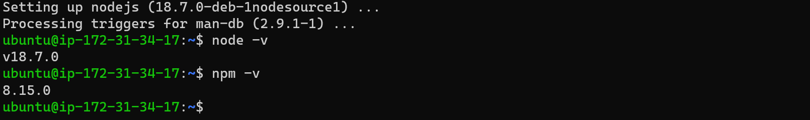
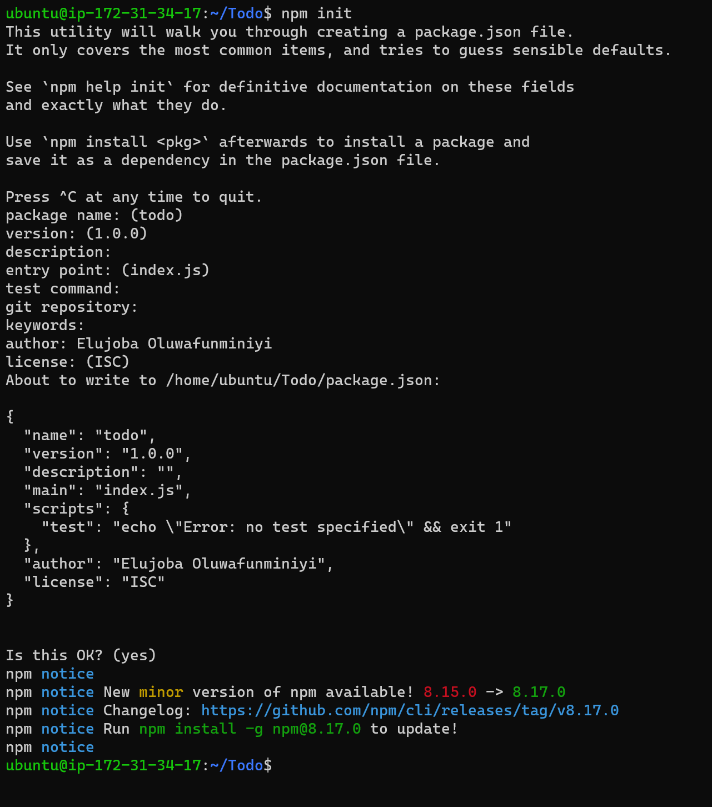
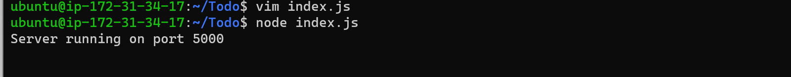
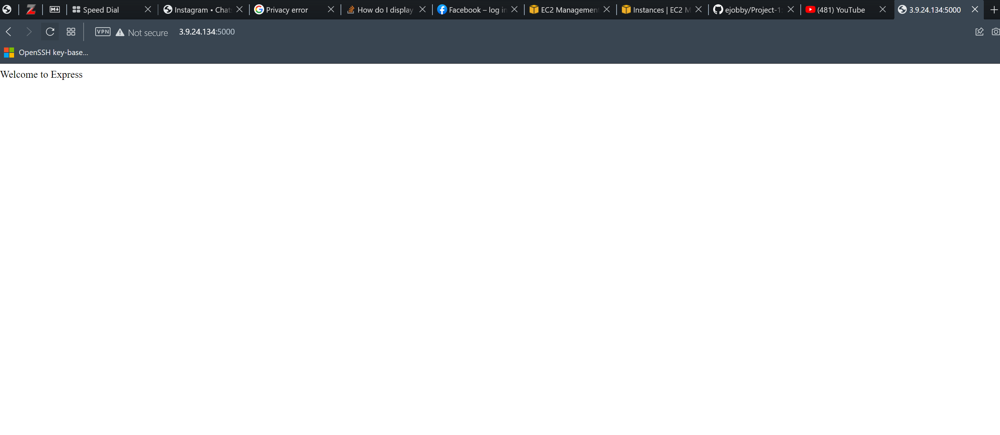
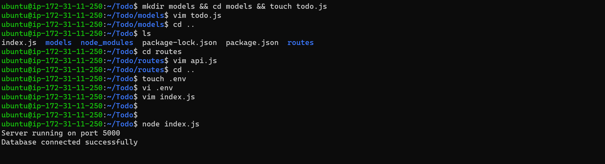
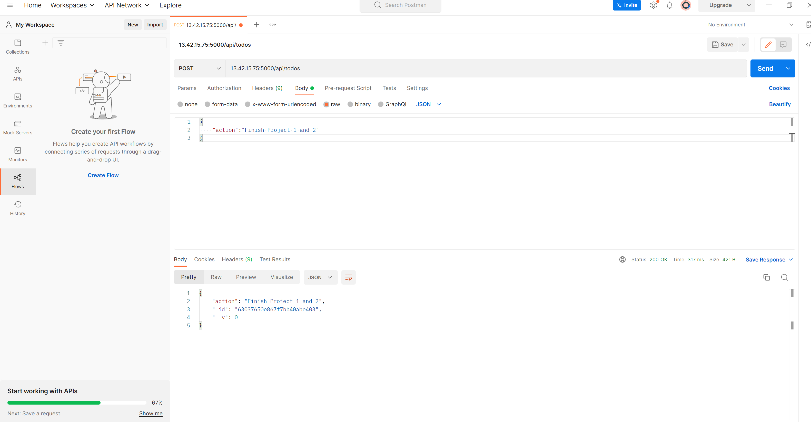
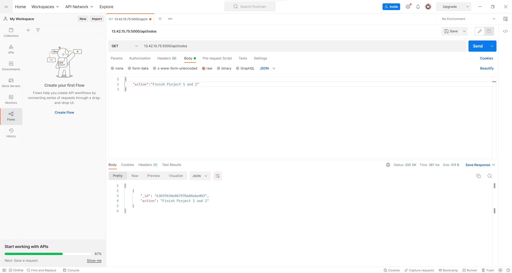
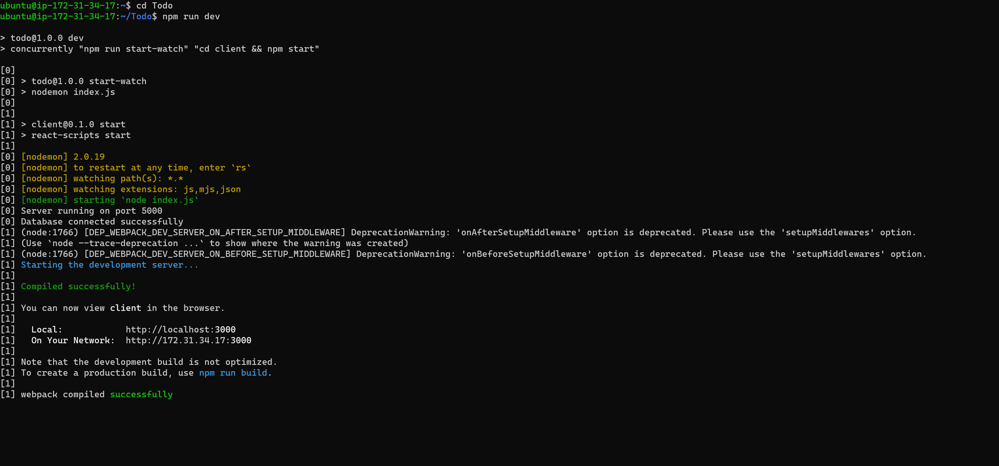
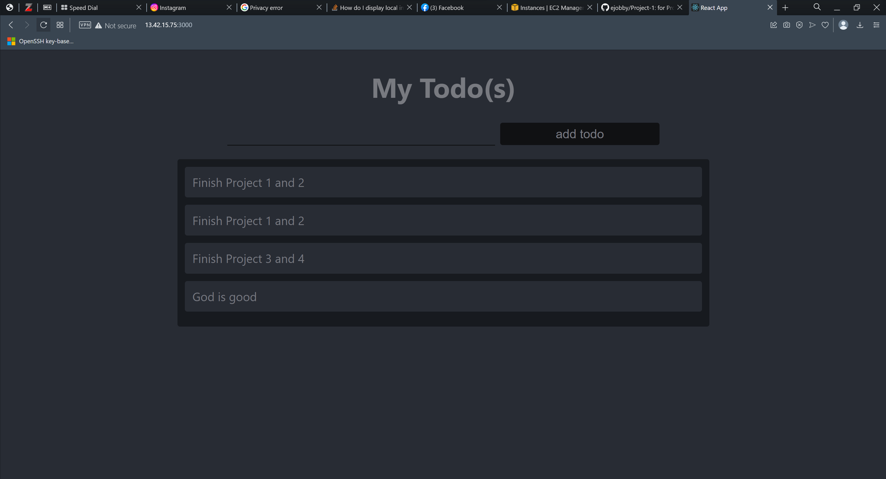

# Project-3
for Project 3 (MERN STACK IMPLEMENTATION)

## Backend Configuration

`sudo apt update`

`sudo apt upgrade`

Getting the location of node.js software from Ubuntu repositories

`curl -fsSL https://deb.nodesource.com/setup_18.x | sudo -E bash -`

`sudo apt-get install -y nodejs`

verify the node installation 

`npm -v`



## Application Code Setup

`mkdir Todo`

`cd Todo`

`npm init`




## Install ExpressJs

Install the expressjs inside the Todo Directory

`npm install express`

create a file named index.js in the Todo directory

`touch index.js`

###Install the dotenv module

`npm install dotenv`

`vim index.js`

copy the following code inside the index.js

```
const express = require('express');
require('dotenv').config();

const app = express();

const port = process.env.PORT || 5000;

app.use((req, res, next) => {
res.header("Access-Control-Allow-Origin", "\*");
res.header("Access-Control-Allow-Headers", "Origin, X-Requested-With, Content-Type, Accept");
next();
});

app.use((req, res, next) => {
res.send('Welcome to Express');
});

app.listen(port, () => {
console.log(`Server running on port ${port}`)
});
```

Then run the code

`node index.js`






## Creating Routes to complete the task

Create a folder called routes inside the Todo directory

`mkdir routes`

`cd routes`

create api.js

`touch api.js`

edit the api.js and insert the code underneath

`vim api.js`

```
const express = require ('express');
const router = express.Router();

router.get('/todos', (req, res, next) => {

});

router.post('/todos', (req, res, next) => {

});

router.delete('/todos/:id', (req, res, next) => {

})

module.exports = router;
```

Go back to the Todo Directory

`cd ..`

Install mongoose

`npm install mongoose`

Create a folder under the Todo directory

`mkdir models`

`cd models`

create and edit the todo.js

`touch todo.js`

`vim todo.js`

insert the following code

```
const mongoose = require('mongoose');
const Schema = mongoose.Schema;

//create schema for todo
const TodoSchema = new Schema({
action: {
type: String,
required: [true, 'The todo text field is required']
}
})

//create model for todo
const Todo = mongoose.model('todo', TodoSchema);

module.exports = Todo;
```

Change the directory to Todo/routes

`cd ../routes`

`vim api.js`

replace the content of api.js with the code underneath

```
const express = require ('express');
const router = express.Router();
const Todo = require('../models/todo');

router.get('/todos', (req, res, next) => {

//this will return all the data, exposing only the id and action field to the client
Todo.find({}, 'action')
.then(data => res.json(data))
.catch(next)
});

router.post('/todos', (req, res, next) => {
if(req.body.action){
Todo.create(req.body)
.then(data => res.json(data))
.catch(next)
}else {
res.json({
error: "The input field is empty"
})
}
});

router.delete('/todos/:id', (req, res, next) => {
Todo.findOneAndDelete({"_id": req.params.id})
.then(data => res.json(data))
.catch(next)
})

module.exports = router;
```

Create a MongoDB database and collection inside mLab and copy out the connection link string

Change the directory back to the Todo directory on your terminal

`cd ..`

create a file and name .nv

`touch .env`
`vi .env`

insert the code inside the .env

```
DB = 'mongodb+srv://<username>:<password>@<network-address>/<dbname>?retryWrites=true&w=majority'
```

Simply delete existing content in index.js, and update it with the entire code below.

`vim index.js`

```
const express = require('express');
const bodyParser = require('body-parser');
const mongoose = require('mongoose');
const routes = require('./routes/api');
const path = require('path');
require('dotenv').config();

const app = express();

const port = process.env.PORT || 5000;

//connect to the database
mongoose.connect(process.env.DB, { useNewUrlParser: true, useUnifiedTopology: true })
.then(() => console.log(`Database connected successfully`))
.catch(err => console.log(err));

//since mongoose promise is depreciated, we overide it with node's promise
mongoose.Promise = global.Promise;

app.use((req, res, next) => {
res.header("Access-Control-Allow-Origin", "\*");
res.header("Access-Control-Allow-Headers", "Origin, X-Requested-With, Content-Type, Accept");
next();
});

app.use(bodyParser.json());

app.use('/api', routes);

app.use((err, req, res, next) => {
console.log(err);
next();
});

app.listen(port, () => {
console.log(`Server running on port ${port}`)
});
```

`node index.js`



Use Postman to Post and Get request to our API

Using Postman for Post Request 


Using Postman for Get Request



## Frontend Creation

Go to the Todo directory

`npx create-react-app client`

install concurrently

`npm install concurrently --save-dev`

install nodemon

`npm install nodemon --save-dev`

edit the package.json inside the Todo directory and insert the following under the scripts:

`vi package.json`

```
"scripts": {
"start": "node index.js",
"start-watch": "nodemon index.js",
"dev": "concurrently \"npm run start-watch\" \"cd client && npm start\""
},
```

Change the directory to client inside the Todo

`cd client`

`vi package.json`

add the code into the content of package.json

```
"proxy": "http://localhost:5000"
```

change the directory back to the Todo

`cd ..`

`npm run dev`

### Creating React Components

`cd client`

`cd src`

`mkdir components`

create three files inside the components directory

`touch Input.js ListTodo.js Todo.js`

edit the Input.js and paste the code below inside

`vi Input.js`

```
import React, { Component } from 'react';
import axios from 'axios';

class Input extends Component {

state = {
action: ""
}

addTodo = () => {
const task = {action: this.state.action}

    if(task.action && task.action.length > 0){
      axios.post('/api/todos', task)
        .then(res => {
          if(res.data){
            this.props.getTodos();
            this.setState({action: ""})
          }
        })
        .catch(err => console.log(err))
    }else {
      console.log('input field required')
    }

}

handleChange = (e) => {
this.setState({
action: e.target.value
})
}

render() {
let { action } = this.state;
return (
<div>
<input type="text" onChange={this.handleChange} value={action} />
<button onClick={this.addTodo}>add todo</button>
</div>
)
}
}

export default Input
```

Install Axios inside the Clients Directory

`cd ../..`

`npm install axios`

Change the directory to src/components to edit the ListTodo.js and Todo.js

`cd src/components`

`vi ListTodo.js`

copy the code under inside the ListTodo.js

```
import React from 'react';

const ListTodo = ({ todos, deleteTodo }) => {

return (
<ul>
{
todos &&
todos.length > 0 ?
(
todos.map(todo => {
return (
<li key={todo._id} onClick={() => deleteTodo(todo._id)}>{todo.action}</li>
)
})
)
:
(
<li>No todo(s) left</li>
)
}
</ul>
)
}

export default ListTodo
```

`vi Todo.js`

copy the code under inside the Todo.js

```
import React, {Component} from 'react';
import axios from 'axios';

import Input from './Input';
import ListTodo from './ListTodo';

class Todo extends Component {

state = {
todos: []
}

componentDidMount(){
this.getTodos();
}

getTodos = () => {
axios.get('/api/todos')
.then(res => {
if(res.data){
this.setState({
todos: res.data
})
}
})
.catch(err => console.log(err))
}

deleteTodo = (id) => {

    axios.delete(`/api/todos/${id}`)
      .then(res => {
        if(res.data){
          this.getTodos()
        }
      })
      .catch(err => console.log(err))

}

render() {
let { todos } = this.state;

    return(
      <div>
        <h1>My Todo(s)</h1>
        <Input getTodos={this.getTodos}/>
        <ListTodo todos={todos} deleteTodo={this.deleteTodo}/>
      </div>
    )

}
}

export default Todo;
```

change the directory to src directory

`cd ..`

`vi api.js`

copy the code under inside the api.js

```
import React from 'react';

import Todo from './components/Todo';
import './App.css';

const App = () => {
return (
<div className="App">
<Todo />
</div>
);
}

export default App;
```

`vi App.css`

copy the code under in side the App.css

```
.App {
text-align: center;
font-size: calc(10px + 2vmin);
width: 60%;
margin-left: auto;
margin-right: auto;
}

input {
height: 40px;
width: 50%;
border: none;
border-bottom: 2px #101113 solid;
background: none;
font-size: 1.5rem;
color: #787a80;
}

input:focus {
outline: none;
}

button {
width: 25%;
height: 45px;
border: none;
margin-left: 10px;
font-size: 25px;
background: #101113;
border-radius: 5px;
color: #787a80;
cursor: pointer;
}

button:focus {
outline: none;
}

ul {
list-style: none;
text-align: left;
padding: 15px;
background: #171a1f;
border-radius: 5px;
}

li {
padding: 15px;
font-size: 1.5rem;
margin-bottom: 15px;
background: #282c34;
border-radius: 5px;
overflow-wrap: break-word;
cursor: pointer;
}

@media only screen and (min-width: 300px) {
.App {
width: 80%;
}

input {
width: 100%
}

button {
width: 100%;
margin-top: 15px;
margin-left: 0;
}
}

@media only screen and (min-width: 640px) {
.App {
width: 60%;
}

input {
width: 50%;
}

button {
width: 30%;
margin-left: 10px;
margin-top: 0;
}
}
```

`vim index.css`

copy the code under inside the index.css

```
body {
margin: 0;
padding: 0;
font-family: -apple-system, BlinkMacSystemFont, "Segoe UI", "Roboto", "Oxygen",
"Ubuntu", "Cantarell", "Fira Sans", "Droid Sans", "Helvetica Neue",
sans-serif;
-webkit-font-smoothing: antialiased;
-moz-osx-font-smoothing: grayscale;
box-sizing: border-box;
background-color: #282c34;
color: #787a80;
}

code {
font-family: source-code-pro, Menlo, Monaco, Consolas, "Courier New",
monospace;
}
```

Change the directory back to the Todo directory

`cd ../..`

`npm run dev`




On the browswe, type Public-Ip-Address:30000



The End of the MERN Stack Implementation

